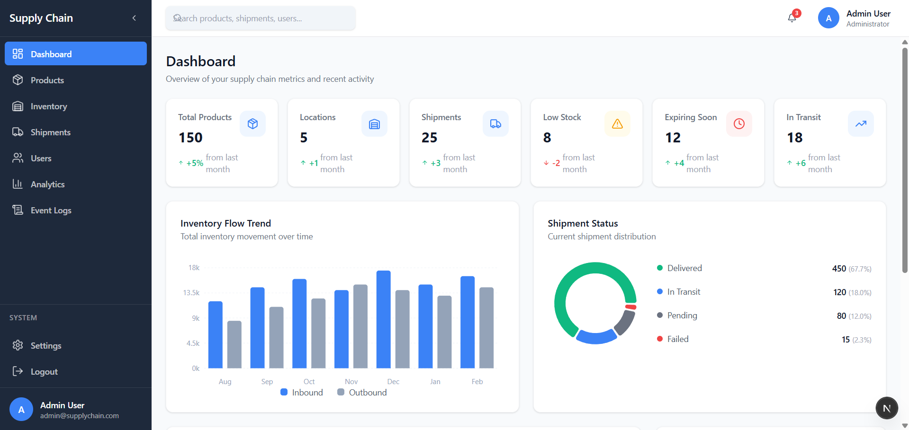
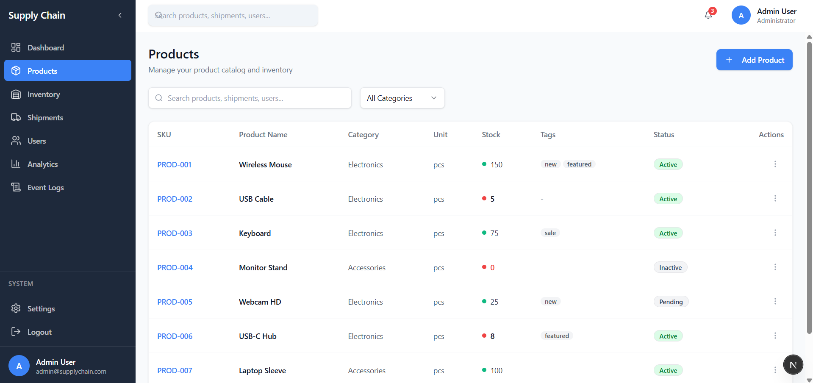
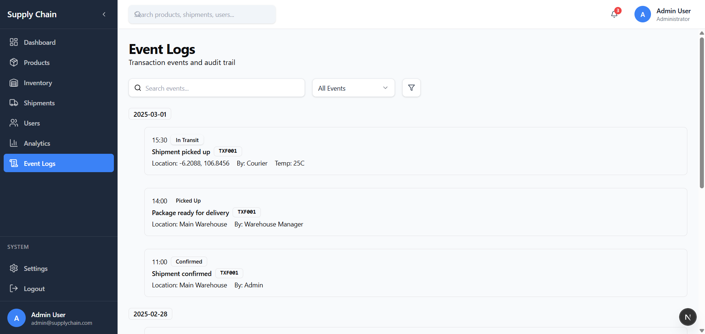

# Supply Chain Management System

> Web-based dashboard for tracking products, inventory, and shipments across multiple locations.

---

## Preview

| Dashboard | Products | Log |
|----------|----------|-----------|
|  |  |  |

---

## Features

### Core Features
- **Dashboard** - Overview with summary cards, charts, and recent activity
- **Product Management** - Manage products with SKU, categories, and stock levels
- **Inventory Tracking** - Real-time stock across multiple locations
- **Shipment Tracking** - Track shipments with status updates
- **User Management** - Manage users with roles and permissions
- **Analytics** - Reports with export options (PDF, Excel, CSV)
- **Event Logs** - Transaction history timeline
- **Settings** - Profile and notification preferences

### UI/UX
- Modern design with dark sidebar and clean layout
- Responsive design
- Toast notifications
- Route protection with authentication

---

## Tech Stack

| Category | Technology |
|----------|-----------|
| Framework | Next.js 15 (App Router) |
| UI Library | React 19 |
| Language | TypeScript 5 |
| Styling | Tailwind CSS 4 |
| Components | shadcn/ui (Radix UI) |
| Icons | Lucide React |
| State Management | TanStack Query v5 |
| Charts | Recharts |
| Auth | JWT (Cookie-based) |

---

## Project Structure

```
supply-chain-tracking/
├── app/
│   ├── (auth)/              # Auth pages (no sidebar/header)
│   │   ├── login/
│   │   └── register/
│   ├── (main)/              # Protected pages (with sidebar/header)
│   │   ├── page.tsx         # Dashboard
│   │   ├── analytics/
│   │   ├── inventory/
│   │   ├── products/
│   │   ├── shipments/
│   │   ├── settings/
│   │   ├── users/
│   │   └── event-logs/
│   ├── layout.tsx           # Root layout
│   └── globals.css          # Global styles
│
├── components/
│   ├── ui/                  # shadcn/ui components
│   ├── layout/              # Layout components
│   ├── auth/                # Auth components
│   └── shared/              # Reusable components
│
├── lib/
│   ├── query-client.tsx     # TanStack Query setup
│   ├── utils.ts             # Helper functions
│   ├── api.ts               # API client
│   └── constants.ts         # App constants
│
├── hooks/
│   └── use-toast.ts         # Toast notifications
│
├── types/
│   └── index.ts             # TypeScript types
│
├── docs/
│   └── preview/             # Preview screenshots
│
├── proxy.ts                 # Next.js 16 middleware (auth)
├── tailwind.config.ts
├── tsconfig.json
└── package.json
```

---

## Installation

### Prerequisites
- Node.js 18+
- npm or yarn or pnpm

### Setup

1. Clone the repository
   ```bash
   git clone https://github.com/KuyangC/Supply_Chain_Management.git
   cd Supply_Chain_Management
   ```

2. Install dependencies
   ```bash
   npm install
   ```

3. Run development server
   ```bash
   npm run dev
   ```

4. Open browser
   ```
   http://localhost:3000
   ```

---

## Authentication

Currently uses **dummy authentication** for frontend testing:

- Any email/password combination works
- Stores auth token in localStorage + cookie
- Auto-redirect to login if not authenticated

**Note:** This will be replaced with real backend API authentication.

---

## Pages

| Route | Page | Description |
|-------|------|-------------|
| /login | Login | Sign in page |
| /register | Register | Create account |
| / | Dashboard | Overview with stats and charts |
| /products | Products | Product catalog management |
| /inventory | Inventory | Stock levels by location |
| /shipments | Shipments | Shipment tracking |
| /users | Users | User management |
| /analytics | Analytics | Reports and exports |
| /event-logs | Event Logs | Transaction history |
| /settings | Settings | Profile & preferences |

---

## Design System

### Colors
```css
/* Primary */
--primary: #3b82f6;      /* Blue */
--success: #10b981;      /* Green */
--warning: #f59e0b;      /* Amber */
--danger: #ef4444;       /* Red */

/* Background */
--bg-sidebar: #1e293b;   /* Dark Navy */
--bg-main: #f8fafc;      /* Light Gray */
--bg-card: #ffffff;      /* White */
```

### Components
- **Buttons** - Primary (blue), Secondary (white with border)
- **Tables** - White background, alternating rows
- **Status Badges** - Colored backgrounds (green, blue, amber, red, gray)
- **Cards** - White with subtle shadow

---

## Related Projects

- **Backend API** - [supply-chain-backend](https://github.com/KuyangC/supply-chain-backend)
  - NestJS + Prisma + MySQL

---

## Roadmap

- [ ] Connect to real backend API
- [ ] Implement real authentication (JWT)
- [ ] Add form validation
- [ ] Create modal components for Add/Edit
- [ ] Add PDF/Excel export functionality
- [ ] Real-time updates (WebSocket)
- [ ] Mobile app (React Native)

---

## License

This project is private and proprietary.

---

## Authors

- **KuyangC** - [@KuyangC](https://github.com/KuyangC)

---

## Acknowledgments

- [shadcn/ui](https://ui.shadcn.com/) - UI components
- [Lucide](https://lucide.dev/) - Icons
- [Tailwind CSS](https://tailwindcss.com/) - Styling
- [Next.js](https://nextjs.org/) - Framework
